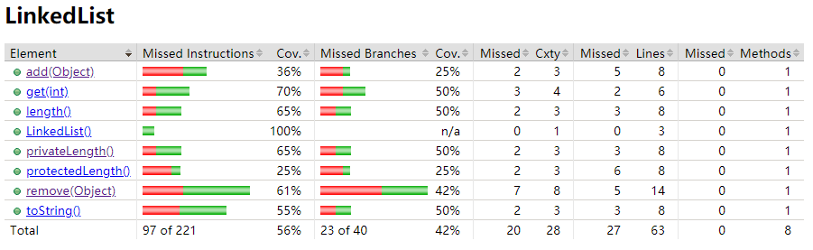
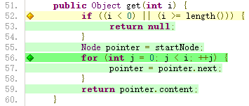
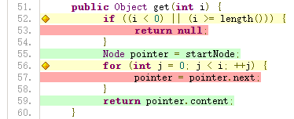

# Introduction to Code Coverage with Jacoco
----
Chan Ho Ting, Martin Gabrielsen

## Introduction
Testing is important in developing a system. It helps the developer to ensure that functions work well by providing test cases and asserting its result. This article will introduce what is code coverage, based on java development environment and Gradle. This tutorial will explain different types of code coverage criteria and discuss the usage of code coverage.

The example used in this tutorial is a basic linked list implementation. The code used in this tutorial can be downloaded from [here](github).

We start with introducing JUnit and Jacoco which help further explanation on code coverage.

## Code Coverage

If you look at Wikipedia, test coverage means : 

> ... a measure used to describe the degree to which the source code of a program is executed when a particular test suite runs.

When we talk about test coverage, we first need a testing suite, which is testing the code itself. However, if we execute tests for a program, not everything is being tested. Therefore, we need a code coverage analysis tool to measure how much it covers and how good the tests are. In Java, we use JUnit as the test suite and Jacoco as code coverage analysis tool.

## JUnit

For those who don't know JUnit, JUnit is a testing suite in Java. It provides the basic testing interface with `@Test` annotation by `import org.junit.Test`. In JUnit, developers only have to write test cases in function under `@Test` annotation. There are also `@Before`, `@After`, `@BeforeClass` and `@AfterClass` annotation, but to make it simpler, we will just use `@Test` annotation in our examples. 

```java
@Test
public void testCaseExample() {
    String expected = "hello world";
    String actual = "hello world";
    assertEquals(expected, actual); 
}
```


## Jacoco
Jacoco is a code coverage analysis tool based on JUnit. Jacoco will test if a specific line or a branch has been reached or not. We have to add some code in Gradle to use Jacoco.

```
// build.gradle
plugins {
	id 'jacoco'
}
jacocoTestReport {
    reports {
        xml.enabled false
        csv.enabled false
        html.destination file("${buildDir}/jacocoHTML")
    }
}

jacoco{
	toolVersion = "0.8.5"
}
```


You can type `./gradlew clean test jacocoTestReport` in console under the base project directory to generate the jacoco test coverage report. 

Example Report : 



You can see diamonds with 3 colors in the report :

- Red Diamond		: None of the branch had been executed in JUnit test
- Yellow Diamond	: Some branch had not been executed in JUnit test
- Green Diamond	: All branch had been executed in JUnit test

and lines with 3 colors :

- Red Line		: That line had not been executed in test

- Yellow Line	: Some conditions in that line had not been executed in the test, this always comes with yellow diamonds. 

- Green Line	: That line had been executed in test

  

We will discuss how the "executed" decided in the following.

## Functional Coverage
Functional Coverage is the criteria for checking if a function has been called in a test or not. It calculates in Number_of_Functions_Called / Total_Number_of_function * 100%.

Here is the test report on `library.LinkedList` having 100% functional coverage.

Test case used : 

```java
@Test
public void testAllFunction() {
    LinkedList l = new LinkedList();        // test constructor
    l.add("abc");                           // test add(Object)
    assertEquals(1, l.length());            // test length()
    assertEquals("abc", l.get(0));          // test get(int)
    assertEquals("[abc]", l.toString());    // test toString()
    Object obj = l.remove("abc");           // test remove()
    assertEquals("abc", obj);
    assertEquals(0, l.length());
}
```

Jacoco report generated : 


In the test report, you can see that there are many red lines in the test report, but there are at least one yellow or green line in each function, which means all functions are called at least once. As functional coverage concerns whether the function has been called or not, but not all functionality of a function has been tested, In this test case, it will have 100% functional coverage.

You can run `./gradlew clean functionalCoverage test jacocoTestReport`

## Statement Coverage
Statement coverage is the criteria that checks all statements in a test case. The coverage is calculate in Lines_of_Code_Executed / Total_Lines_of_Code * 100%. 

Here is the test report of on `get(int)` function of `library.LinkedList` having 100% statement coverage

Test case used : 

```java
@Test
public void testAllStatement() {
    LinkedList l = new LinkedList();
    l.add("abc");
    l.add("def");
    l.add("ghi");
    assertEquals(null, l.get(-1));    // test on line 51 - 54
    assertEquals("def", l.get(1));    // test on line 55 - 59
}
```

Jacoco report generated : 



The report shows that every line of `get(int)` has been reached by the test case used. The Yellow diamond on line 52 means at least one, but not all conditions of that line have been reached. As statement coverage focuses on coverage of each line. It does not care about the condition of branches being covered in the test. Thus, we have 100% coverage in this example.



You can see that the same function tested in the functional coverage does not achieve 100% statement coverage. As line 53 requires special input to reach so it is not tested.

You can run `./gradlew clean statementCoverage test jacocoTestReport` to try it yourself.

## Edge Coverage
Edge Coverage focuses on each edge in a control flow graph of function. Take `toString()` as an example. The function is 

```java
public String toString() {
    if (startNode == null) {
        return "[]";
    }
    Node pointer = startNode;
    String str = pointer.content.toString();
    while (pointer.next != null) {
        pointer = pointer.next;
        str += ", " + pointer.content.toString();
    }
    return "[" + str + "]";
}
```

Control flow graph of `toString()` : 


There are 3 ways to end this function (edge) :

1. go to `return "[]"` directly
2. go to `return "[" + str + "]"` without getting in loop
3. go to `return "[" + str + "]"` with getting in loop

The following JUnit test can cover all 3 edges

```java
@Test
public void testAllDecision() {
    LinkedList l = new LinkedList();
    assertEquals("[]", l.toString());           // test edge 1
    l.add("abc");
    assertEquals("[abc]", l.toString());        // test edge 2
    l.add("def");
    assertEquals("[abc, def]", l.toString());   // test edge 3
}
```

Jacoco test report generated :


As edge coverage focuses on all edges. it will have all green lines and green diamonds if you have 100% edge coverage.

You can run `./gradlew clean edgeCoverage test jacocoTestReport` to get the result.

## Condition Coverage
Condition coverage focuses on the predicate inside the function. Take `remove(Object)` as an example. The code of `remove(Object)` is

```java
public Object remove(Object obj) {
        if (startNode == null) {		/*predicate 0*/
            return null;
        }
        Node pointer = startNode;
        while ((!pointer.content.equals(obj)) /*predicate 1*/
               && (pointer.next != null)/* prdicate 2*/) {	
            pointer = pointer.next;
        }
        if (pointer.content.equals(obj)) {	/*predicate 3*/
            if (pointer == startNode) {
                startNode = startNode.next;
            }
            if (pointer.previous != null) {	/*predicate 4*/
                pointer.previous.next = pointer.next;
            }
            if (pointer.next != null) {		/*predicate 5*/
                pointer.next.previous = pointer.previous;
            }
            return pointer.content;
        }
        return null;
    }
```

There are several predicate in this function, eg. `(!pointer.content.equals(obj))`, `(pointer.next != null)`. To get 100% condition coverage, we have to test it with both true and false cases. take the predicate 1 and 2 in the while loop as example, if we want to get 100% condition coverage, we have to use at least two test cases, one is getting false in both cases, another is getting true in both cases. The predicate is considered independently, we do not have to provide all 4 combinations of conditions to achieve 100% condition coverage.

Test case used : 

```java
@Test
public void testCondifion() {
    LinkedList l = new LinkedList();
    l.remove("123");    // test predicate 0 (true)
    l.add("abc");
    l.add("def");
    l.add("ghi");
    assertEquals("[abc, def, ghi]", l.toString());
    l.remove("jkl");    // test predicate 0 (false), 1 (false), 2 (true & false), 3 (false)
    l.remove("def");    // test predicate 1 (true), 3(true), 4 (false), 5 (false)
    assertEquals("[abc, ghi]", l.toString());
    l.remove("ghi");    // test predicate 5 (true)
    assertEquals("[abc]", l.toString());
    l.remove("abc");    // test predicate 4 (true)
    assertEquals("[]", l.toString());
}
```

Jacoco test report generated :


You can see this is all green line and green diamond, but actually there is some case that the 100% condition coverage does not imply 100% edge coverage. For example, 

```java
if ((a >= 1) && (a <= 10)) {
    System.out.println("line reached !!!");
}
```

If using `a = 0;` and `a = 11;` to test the above if branch, the println will never be reached, so it is not 100% edge coverage. However, `a = 0;` causes `(a >= 1)` gives `false` and `a = 11;` causes `(a >= 1)` gives `true`. Similar logic applies for `(a <=  10)`. Both predicates are checked, thus It has a 100% condition coverage. 

To get the result of condition coverage, type `./gradlew clean conditionCoverage test jacocoTestReport`

## Coverage on Whitebox Test
If a developer knows the source code, such as testing on a self build library, it is a whitebox testing. We tend to use the statement coverage, edge coverage and condition coverage. With these criteria, we can ensure that most of the functionality works fine in most of the cases.

## Coverage on Blackbox Test
If a developer does not know the source code, such as testing on an external library, it is a blackbox test. We tend to use functional coverage. As we do not know what is inside the internal library. We cannot use statement, edge or condition coverage. We would like to ensure the test covers all functions, so we can just write the test case and assert the result.

## Coverage on protected and private function
To test the protected and default function of a class, just put the test under the same package as target class. In java, the class under the same package is able to call other class protected and default functions. 
In java, the private function is limited to be called by its class. There are problems on testing the private function by another class.

Actually you do not have to worry about this. All private functions will be called by some public, protected or default function. When you apply test cases on the function which will call other private functions, it will also execute the code in the private function and test for its coverage. If there is a function that cannot be reached by any public, protected or default functions, maybe you should conduct a review on your program structure because such a private function should never exist. You can check on how to test the private sub class in the linked list example. In the example, there is a private class `Node` in `LinkedList`. Although `Node` is a private class, it is being tested when some element is added into the list as it creates a new `Node` and puts it into `LinkedList`.

## Conclusion
After this tutorial, you may find that the code coverage is really useful as it convinces you that the code has been reached by some test case and there is no test case report error. It should imply that the code will work well even if it has been deployed. Even if you get 100% code coverage, it only means that your test case is good in quantity, but not quality. The quality is based on the input you put into testing your code. You can run the `./gradlew clean fullCoverage test jacocoTestReport` to generate a coverage report with 100% statement, edge and condition coverage, but there are logical bugs I made in the code.  You can try to write a test case that may crash the `LinkedList` library. It will be a good practice for writing test cases and learning that code coverage is not guarantee a bug free code.