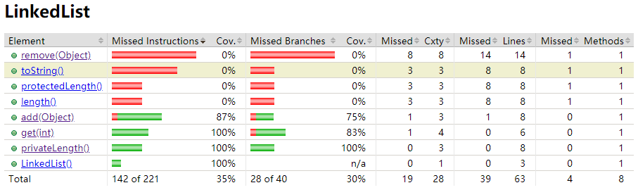

# Introduction to Code Coverage with Jacoco
----
Chan Ho Ting, Martin Gabrielsen

## Introduction
Testing is important in DevOps. From continue integration to continue deployment, developer should run the test case to make sure that the functions in new implemented or bugs solved version work well by providing test cases and asserting its result. One of the criteria to define a test is good enough or not is code coverage and this article will introduce what is code coverage, based on java development environment and Gradle. This tutorial will explain different types of code coverage criteria and discuss the usage of code coverage.

The example used in this tutorial is a basic linked list implementation. The code used in this tutorial can be downloaded from [here](https://github.com/htchan/DevOp-Tutorial-Code-Coverage). To compile and run this project, please make sure you have installed [**java 1.8**](https://java.com/en/download/help/download_options.xml) or higher, [**gradle**](https://docs.gradle.org/current/userguide/installation.html) and [**Jacoco**](https://www.eclemma.org/jacoco/) in your computer.

We start with introducing gradle, JUnit and Jacoco which help further explanation on code coverage.

## Code Coverage

If you look at Wikipedia, test coverage means : 

> ... a measure used to describe the degree to which the source code of a program is executed when a particular test suite runs.

When we talk about test coverage, we first need a testing suite, which is testing the code itself. However, if we execute tests for a program, not everything is being tested. Therefore, we need a code coverage analysis tool to measure how much it covers and how good the tests are. In Java, we use JUnit as the test suite and Jacoco as code coverage analysis tool.

## Gradle

Gradle is an open-source build automation tool for building a project. After installed Gradle, you can build the project by `gradle build` or test the project by `gradle test`. Except the build in function, you can also define your own rule and apply pulgin to the project by modifying the `build.gradle`. In this project, we apply jacoco plugin and junit plugin by  adding following lines into `build.gradle`. For more details, you can check the [user guild](https://docs.gradle.org/current/userguide/userguide.html) or find [tutorial](https://gradle.org/guides/) on their official website.
```
plugins {
	id 'jacoco'
}
apply plugin: 'jacoco'
dependencies {
    testCompile group: 'junit', name: 'junit', version: '4.12'
}
jacocoTestReport {
    reports {
        xml.enabled false
        csv.enabled false
        html.destination file("${buildDir}/jacocoHTML")
    }
}
jacoco{
	toolVersion = "0.8.5"
}
```

## JUnit

For those who don't know JUnit, JUnit is a testing suite in Java. It provides the basic testing interface with `@Test` annotation by `import org.junit.Test`. In JUnit, developers only have to write test cases in function under `@Test` annotation. There are also `@Before`, `@After`, `@BeforeClass` and `@AfterClass` annotation, but to make it simpler, we will just use `@Test` annotation in our examples. 

```java
@Test
public void testCaseExample() {
    int expected = "hello world".length();
    int actual = "hello world".length();
    assertEquals(expected, actual); 
}
```

## Jacoco
Jacoco is a code coverage analysis tool based on JUnit. Jacoco will test if a specific line or a branch has been reached or not. We have to add some code in Gradle to use Jacoco.

```
// build.gradle
plugins {
	id 'jacoco'
}
jacocoTestReport {
    reports {
        xml.enabled false
        csv.enabled false
        html.destination file("${buildDir}/jacocoHTML")
    }
}

jacoco{
	toolVersion = "0.8.5"
}
```

You can type `gradle clean test jacocoTestReport` in console under the base project directory to generate the jacoco test coverage report and find the report in `build/jacocoHTML/index.html`. 

Example Report : 


You can see diamonds with 3 colors in the report :

- Red Diamond		: None of the branch had been executed in JUnit test
- Yellow Diamond	: Some branch had not been executed in JUnit test
- Green Diamond	: All branch had been executed in JUnit test

and lines with 3 colors :

- Red Line		: That line had not been executed in test

- Yellow Line	: Some conditions in that line had not been executed in the test

- Green Line	: That line had been executed in test

We will discuss how the "executed" decided in the following.

## Jacoco code coverage mechanism
To generate a Jacoco report, you may run `gradle test jacocoTestReport` in the terminal. In the command, the `test` will compile the java file to java bytecode file, which is design for running on java virtual machine, then run the test class with junit test to generate a test report. After that, the `jacocoTestReport` will get the coverage information by amending the bytecode file compiled in `test` and run it to collect runtime information of the test.

Jacoco will add some extra bytecode instruction into compiled bytecode file as a flag for java agent to collect the coverage information of tests. There are different strategy to add an extra instruction in different bytecode instruction cases, you may check [control flow analysis](https://www.jacoco.org/jacoco/trunk/doc/flow.html) for more details. Through analysis the information collected by java agent, Jacoco will generate the bytecode level coverage report with statement coverage and branch coverage.

As Jacoco is working on the bytecode, it may give the special result the mentioned above, a Yellow Line. There may be more than one bytecode instructions being generated from a line of code in the convertion, but not all instructions converted from a line will be executed. One of the examples will be
```java
if (a==1 && b==2 && c==3) {
    System.out println("hello");
} else {
    System.out.println("bye");
}
```
its bytecode concept will be
```java
if(a==1){
    if(b==2) {
        if (c==3) {
            System.out println("hello");
        } else {
            System.out.println("bye");
        }
    } else {
        System.out.println("bye");
    }
} else {
    System.out.println("bye");
} 
```
and the bytecode with flag to check the control flow will be
```java
if(a==1){
    if(b==2) {
        if (c==3) {
            System.out println("hello");
            flag();
        } else {
            System.out.println("bye");
            flag();
        }
        flag();
    } else {
        System.out.println("bye");
        flag();
    }
    flag();
} else {
    System.out.println("bye");
    flag();
}
```
if we have `{a = 1, b = 3, c = 4}` as the input, the `if (c==3) {` will not be executed and you may get a yellow line for `if (a==1 && b==2 && c==3) {` in this case.

## Functional Coverage
Functional Coverage is the criteria for checking if a function has been called in a test or not. The formula is :


Here is the test report on `library.LinkedList` having 100% functional coverage.

Test case used : 

```java
@Test
public void testFunctions() {
    LinkedList l = new LinkedList();        // test constructor
    l.add("abc");                           // test add(Object)
    assertEquals(1, l.length());            // test length()
}
```

Jacoco report generated : 


In the test report, you can see that there are many red lines in the test report, there are just 37.5% function coverage, as only 3 function being called in total 8 functions.

you can append
```java
assertEquals("abc", l.get(0));          // test get(int)
assertEquals("[abc]", l.toString());    // test toString()
Object obj = l.remove("abc");           // test remove()
assertEquals("abc", obj);
assertEquals(0, l.protectedLength());
```
to the test case mentioned above increase the functional coverage to 100% like this


You can run `gradle clean test --tests=library.FunctionalCoverage jacocoTestReport`

## Statement Coverage
Statement coverage is the criteria that checks all statements in a test case. The formula is :


Here is the test report of on `get(int)` function of `library.LinkedList` having 100% statement coverage

Test case used : 

```java
@Test
public void testAllStatement() {
    LinkedList l = new LinkedList();
    l.add("abc");
    l.add("def");
    assertEquals("def", l.get(1));    // test on line 55 - 59
}
```

Jacoco report generated : 


The report shows that line 53 of `get(int)` has not been reached by the test case used, which means we did not get any non exist element from linked list to make the `get(int)` return a `null` result. you can calculate that the statement coverage will be 91%. You can append
```java
assertEquals(null, l.get(-1));    // test on line 51 - 54
```
to the test case above to gain 100% statement coverage in `get(int)` function.


Here, the yellow diamond on line 52 means at least one, but not all conditions of that line have been reached. As statement coverage focuses on coverage of each line. It does not care about the condition of branches being covered in the test. Thus, we have 100% coverage in this example.

You can run `gradle clean test --tests=library.StatementCoverage jacocoTestReport` to try it yourself.

## Branch Coverage
Branch Coverage focus on each branch of the control statement like `if` and `switch` statement. The formula is :


\* As Jacoco is working on the java bytecode, but not the java code directly. There may be more branch than assumed base on the java code and it has a special strategy to get 100% byte code coverage. In java code, if statement with more than one condition will be like

```java
public int branchesExample(int a, int b, int c) {
    if (a==1 && b==2 && c==3) {
        // branch 1
        return 1;
    } else {
        // branch 2
        return 0;
    }
}
```

which having 2 branches, 
but in java bytecode, its will change to be below workflow

```java
public boolean branchesExample(int a, int b, int c) {
    if(a==1){
        // branch 1
        if(b==2) {
            // branch 2
            if (c==3) {
                // branch 3
                return 1;
            } else {
                // branch 4
                return 0;
            }
        } else {
            // branch 5
            return 0;
        }
    } else {
        // branch 6
        return 0;
    } 
}
```

which having 6 branch. 

To test different branch here, we have to input different a, b and c values.

Test case used :

```java
@Test
public void testBranchesExample() {
    Demo d = new Demo();
    assertEquals(1, d.branchesExample(1,2,3));  // a==1, b==2, c==3
    assertEquals(0, d.branchesExample(0,1,2));  // a!=1, b!=2, c!=3
    assertEquals(0, d.branchesExample(1,2,4));  // test branch 4
    assertEquals(0, d.branchesExample(1,3,3));  // test branch 5
    assertEquals(0, d.branchesExample(2,2,3));  // test branch 6
}
```

Jacoco report generated :


There are 2 branches missing in line 13 of our test case. If we want to test both `true` and `false` for `c==3` in java code, we have to make sure the condition before to be `true` for the control reach the line `if (c==3) {` in the bytecode and it is same for testing other conditions. You can append

```java
assertEquals(0, d.branchesExample(1,2,4));  // test branch 4
assertEquals(0, d.branchesExample(1,3,3));  // test branch 5
assertEquals(0, d.branchesExample(2,2,3));  // test branch 6
```

into test case above to generate a 100% branch coverage for `branchesExample(int, int, int)` in `example.Demo` class


you will get all green diamonds in the Jacoco report for a 100% branch coverage.

You can run `gradle clean test --tests=example.BranchCoverage jacocoTestReport` to get the result.

## Coverage on protected function
The protected function of a class can be tested as the public, just put the test under the same package as target class. In java, the class under the same package is able to call other class protected and default functions.

In the `LinkedList.java`, there is a protected function named `protectedLength`. It is same as the `length` function, but it is a protected function, not public. The `protectedLength` can be tested by directly called under the same package.
```java
@Test
public void testProtectedLength() {
    // as the test class is under the same packege with target class
    // you can directly call the protected function to test them
    LinkedList l = new LinkedList();
    assertEquals(0, l.protectedLength());
    l.add("abc");
    assertEquals(1, l.protectedLength());
    l.add("def");
    assertEquals(2, l.protectedLength());
}
```

You can run `gradle clean test --tests=library.ProtectedTest jacocoTestReport` to get the result.

## Coverage on private function
In java, the private function is limited to be called by its class only so we cannot test the private function by directly calling it. However, a private function should be called by some other non-private function, else, the private function will be non reachable and never be exeuted in the program. We can test the private function by calling the public function which call our target private function internally. I had made the `privateLength()` function in `LinkedList` class and it is called in the `get(int)` function, so we can write the test case for `privateLength()` by calling `get(int)`.

Test case used :

```java
@Test
public void testPrivateLength() {
    // private function cannot be tested by simple call
    //int actual = l.privateLength(); // error
    // but you can find some public function make internal call to private function
    LinkedList l = new LinkedList();
    l.add("abc");
    assertEquals("abc", l.get(0));  // test for privateLength() gives 1 (lines 65, 66)
}
```

Jacoco report generated :


to increase the coverage of a private function, you have to give more input to the public function internal called it to execute all lines in the function. you can change the test case to

```java
LinkedList l = new LinkedList();
assertEquals(null, l.get(0));   // test for privatLength() gives 0 (lines 62-64)
l.add("abc");
assertEquals("abc", l.get(0));  // test for privateLength() gives 1 (lines 65, 66)
l.add("def");
assertEquals("def", l.get(1));  // test for privateLength() gives larger than 1 (lines 67-69)
```

and you will get a 100% coverage result in Jacoco.



You can run `gradle clean test --tests=library.PrivateTest jacocoTestReport` to get the result.

## Conclusion
After this tutorial, you may find that the code coverage is really useful as it convinces you that the code has been reached by some test case and there is no test case report error. It should imply that the code will work well even if it has been deployed. Even if you get 100% code coverage, it only means that your test case is good in quantity, but not quality. The quality is based on the input you put into testing your code. You can run the `gradle clean test --tests=library.FullTest jacocoTestReport` to generate a coverage report with 100% statement, edge and condition coverage on `LinkedList` class, but there are logical bugs I made in the `LinkedList` class. You can try to write a test case that may crash the `LinkedList` library. It will be a good practice for writing test cases and learning that code coverage is not guarantee a bug free code.